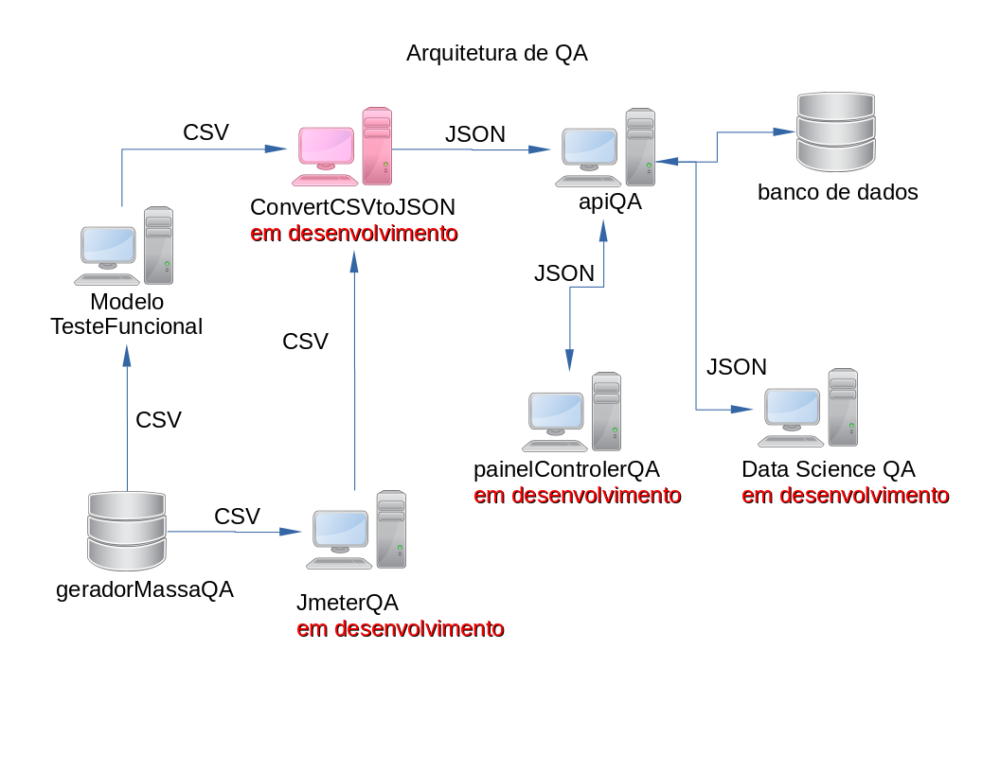

# convertCSVtoJSON

>  Convert CSV to JSON, faz parte do projeto da arquitetura de QA.  
>  Versão 01

> __Descrição do projeto__

> Converte arquivos CSV para o formato JSON é envia para o apiQA

> __Mais informações sobre a Arquitetura QA__ 
>  Email = marcosregato01@gmail.com 
>  Assunto = Arquitetura QA

> __Ferramentas de desenvolvimento__

> * Python 3

> __Observação__

> Caso o sistema que será testado tenha testes unitario usando Junit e Maven.  
> No console os sistema operacional execute o comando.  

> mvn test | tee rsult_test_unitario.txt 

# Links dos projetos da arquitetura

> __Modelo Teste Funcional__
> [Link do projeto](https://github.com/marcosregato/modeloTesteFuncional). 

> __Painel Teste Angular__
> [Link do projeto](https://github.com/marcosregato/painelTesteQA). 

> __Teste API QA__
> [Link do projeto](https://github.com/marcosregato/testeApiQA). 

> __convert CSV to JSON__
> [Link do projeto](https://github.com/marcosregato/convertCSVtoJSON). 

> __Data Science QA__
> [Link do projeto](https://github.com/marcosregato/dataScienceQA). 

> __Api QA__
> [Link do projeto](https://github.com/marcosregato/apiQA). 

> __Test Api QA__
> [GitHub Pages](https://github.com/marcosregato/testApiQA). 

> __Gerador massa de dados QA__
> [Link do projeto](https://github.com/marcosregato/geradorMassaQA). 

